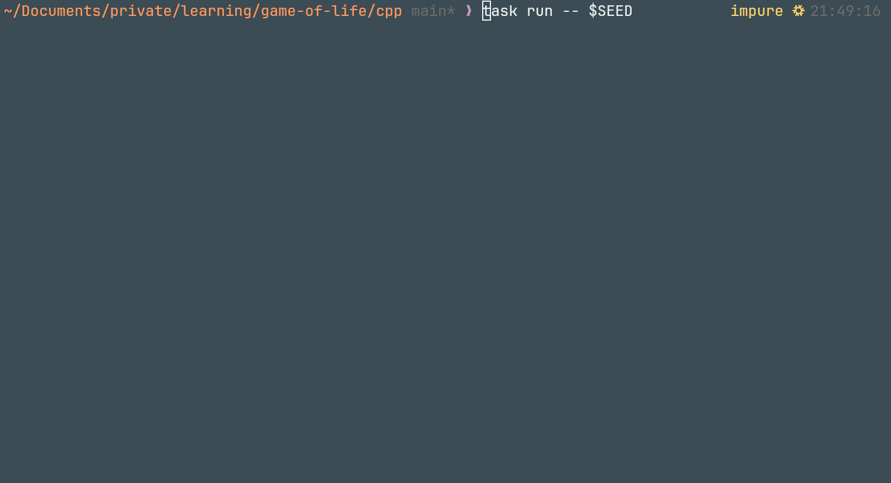

# Game of Life

Some implementations of _Game of Life_.

## Java & Haskell

A functional functional implementations inspired by [rst0git](https://github.com/rst0git/Game-of-Life-Haskell/blob/master/game-of-life.hs).

## C++

Multidimensional Array.

